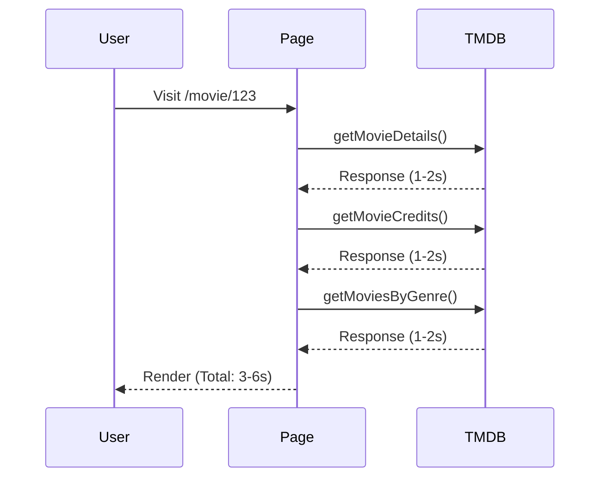
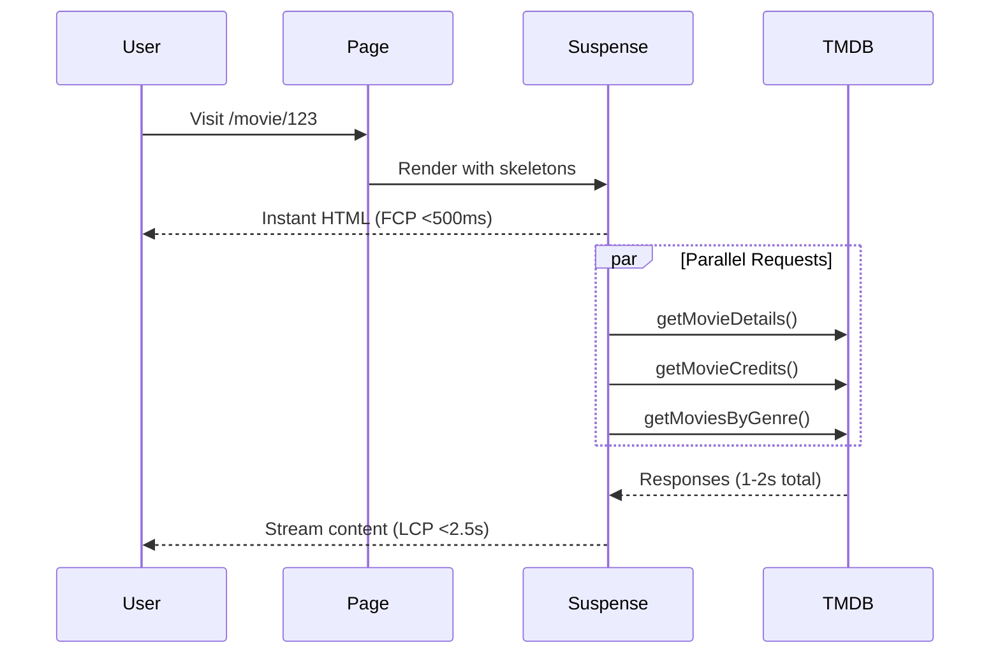

# Performance Optimization Implementation Plan
## Oryno/Stream - Next.js 16 Project

---

## Executive Summary

This document outlines the performance optimization plan for the Oryno/Stream Next.js 16 project based on the analysis of the current codebase against the recommendations in [`docs/NEXTJS_PERFORMANCE_GUIDE.md`](docs/NEXTJS_PERFORMANCE_GUIDE.md).

### Current State Assessment

| Area | Status | Priority |
|------|--------|----------|
| Server Components | ✅ Already using App Router | - |
| Parallel Data Fetching | ⚠️ Partial - Home page OK, detail pages sequential | High |
| Caching Strategy | ✅ Implemented via `next: { revalidate: N }` | - |
| Suspense/Streaming | ⚠️ Genres page only, others blocking | High |
| Error Handling | ⚠️ Partial - TMDB functions return null, but no page-level fallbacks | Medium |
| Fetch Timeout | ❌ Missing - no timeout on fetchWithRetry | Critical |
| Non-retryable Errors | ❌ Retries on DNS failures (ENOTFOUND) | Critical |
| Next.js Config | ⚠️ Missing optimizations | Medium |
| metadataBase | ❌ Missing in layout.tsx | Low |

### Expected Performance Gains

| Optimization | Expected Improvement |
|--------------|---------------------|
| Parallel fetching (detail pages) | 50-70% faster initial render |
| Fetch timeout | Eliminates 20+ second hangs |
| Non-retryable error handling | Faster failure recovery |
| Suspense streaming | Instant FCP, progressive content |
| Static generation (popular pages) | <100ms TTFB |

---

## Detailed Analysis by File

### 1. [`lib/tmdb.ts`](lib/tmdb.ts) - TMDB API Utilities

#### Issues Found

| # | Issue | Severity | Line(s) |
|---|-------|----------|---------|
| 1.1 | `fetchWithRetry` has no timeout - relies on OS TCP timeout (20+ sec) | **Critical** | 61-106 |
| 1.2 | Retries ALL errors including DNS failures (ENOTFOUND) | **Critical** | 96-101 |
| 1.3 | No distinction between retryable/non-retryable errors | **Critical** | 96-101 |
| 1.4 | `getAllMoviesByYear` uses sequential for-loop instead of parallel | High | 894-900+ |
| 1.5 | `getGenresWithThumbnails` has sequential logo fetching | Medium | 287-297 |

#### Current `fetchWithRetry` Implementation (Problematic)
```typescript
// lib/tmdb.ts lines 61-106 - CURRENT (PROBLEMATIC)
async function fetchWithRetry(
	url: string,
	options: RequestInit = {},
	retries = 3
) {
	// ❌ No timeout mechanism
	// ❌ Retries on DNS errors which are non-retryable
	
	try {
		const response = await fetch(url, { ...options });
		// ... error handling
	} catch (error) {
		if (retries > 0) {
			// ❌ Blind retry regardless of error type
			await new Promise((resolve) => setTimeout(resolve, 1000));
			return fetchWithRetry(url, options, retries - 1);
		}
	}
}
```

#### Recommended Fix for `fetchWithRetry`

```typescript
// lib/fetch-utils.ts - NEW FILE
const FETCH_TIMEOUT_MS = 5000;
const RETRY_DELAY_MS = 1000;
const MAX_RETRIES = 2;

const NON_RETRYABLE_ERROR_CODES = new Set([
	'ENOTFOUND',      // DNS failed - host doesn't exist or no internet
	'ECONNREFUSED',   // Server actively refused connection
	'ERR_INVALID_URL', // Malformed URL
]);

export async function fetchWithRetry(
	url: string,
	options: RequestInit = {},
	retries = MAX_RETRIES,
): Promise<Response> {
	const controller = new AbortController();
	const timeoutId = setTimeout(() => controller.abort(), FETCH_TIMEOUT_MS);

	try {
		const response = await fetch(url, {
			...options,
			signal: controller.signal,
		});
		clearTimeout(timeoutId);

		// Don't retry on 4xx client errors
		if (response.status >= 400 && response.status < 500) {
			throw new Error(`Client error: ${response.status}`);
		}

		// Retry on 5xx server errors
		if (!response.ok && retries > 0) {
			await new Promise(r => setTimeout(r, RETRY_DELAY_MS));
			return fetchWithRetry(url, options, retries - 1);
		}

		return response;

	} catch (error) {
		clearTimeout(timeoutId);

		const errorCode = (error as NodeJS.ErrnoException).code ?? '';

		// ❌ Do NOT retry DNS/connection errors - fail fast
		if (NON_RETRYABLE_ERROR_CODES.has(errorCode)) {
			throw new Error(`Non-retryable: ${errorCode}`);
		}

		// ❌ Do NOT retry timeouts
		if ((error as Error).name === 'AbortError') {
			throw new Error(`Timeout after ${FETCH_TIMEOUT_MS}ms`);
		}

		// ✅ Retry on transient errors
		if (retries > 0) {
			await new Promise(r => setTimeout(r, RETRY_DELAY_MS));
			return fetchWithRetry(url, options, retries - 1);
		}

		throw error;
	}
}
```

#### Fix for `getAllMoviesByYear` (Sequential → Parallel)

```typescript
// lib/tmdb.ts - CURRENT
export async function getAllMoviesByYear(year: number, maxPages: number = 5) {
	const allMovies: Movie[] = [];
	// ❌ SEQUENTIAL: Each page waits for previous
	for (let page = 1; page <= maxPages; page++) {
		const response = await fetchWithRetry(...);
		// ...
	}
	return allMovies;
}

// RECOMMENDED
export async function getAllMoviesByYear(year: number, maxPages: number = 5) {
	// ✅ PARALLEL: All pages fetched simultaneously
	const pagePromises = Array.from({ length: maxPages }, (_, i) => 
		fetchWithRetry(
			`${API_BASE_URL}/discover/movie?api_key=${API_KEY}...&page=${i + 1}`,
			{ next: { revalidate: 3600 } }
		).then(r => r.json())
	);
	
	const results = await Promise.all(pagePromises);
	return results.flatMap(r => r.results as Movie[]);
}
```

---

### 2. [`app/movie/[id]/page.tsx`](app/movie/[id]/page.tsx) - Movie Detail Page

#### Issues Found

| # | Issue | Severity | Line(s) |
|---|-------|----------|---------|
| 2.1 | Sequential fetching: movie → relatedMovies → credits | **Critical** | 48-60 |
| 2.2 | No Suspense boundaries for streaming | High | 46-177 |
| 2.3 | No error handling with fallback UI | Medium | 46-60 |
| 2.4 | No generateStaticParams for popular movies | Medium | - |

#### Current Sequential Fetching (Lines 48-60)
```typescript
// app/movie/[id]/page.tsx - CURRENT (SLOW)
const movie = await getMovieDetails(movieId);      // Wait 1-2s
// ... movie is used below
const relatedMovies = await getMoviesByGenre(movie.genres[0].id); // Wait another 1-2s
const credits = await getMovieCredits(movieId);    // Wait another 1-2s
// Total: 3-6 seconds
```

#### Recommended Fix: Parallel Fetching + Suspense

```typescript
// app/movie/[id]/page.tsx - RECOMMENDED
import { Suspense } from 'react';
import { MovieHeroSkeleton, CastSkeleton, SimilarSkeleton } from '@/components/skeletons';

// Page renders INSTANTLY - sends skeleton HTML right away
export default function MoviePage({ params }: MoviePageProps) {
	const movieId = Number((await params).id);
	
	return (
		<SpeculativePreloader movieId={movieId}>
			<div className="min-h-screen bg-background">
				<Navbar />
				
				<Suspense fallback={<MovieHeroSkeleton />}>
					<MovieHero id={movieId} />
				</Suspense>
				
				<div className="max-w-[1800px] mx-auto px-4 py-12 space-y-12">
					<Suspense fallback={<CastSkeleton />}>
						<MovieCast id={movieId} />
					</Suspense>
					
					<Suspense fallback={<SimilarSkeleton />}>
						<SimilarMovies id={movieId} />
					</Suspense>
				</div>
			</div>
		</SpeculativePreloader>
	);
}

// Separate async components - each streams independently
async function MovieHero({ id }: { id: number }) {
	const [movie, credits] = await Promise.all([
		getMovieDetails(id).catch(() => null),
		getMovieCredits(id).catch(() => null),
	]);
	
	if (!movie) return <div>Movie not found</div>;
	
	// ... render hero UI
}

async function MovieCast({ id }: { id: number }) {
	const credits = await getMovieCredits(id);
	if (!credits?.cast?.length) return null;
	
	// ... render cast
}

async function SimilarMovies({ id }: { id: number }) {
	const movie = await getMovieDetails(id);
	if (!movie?.genres?.[0]) return null;
	
	const relatedMovies = await getMoviesByGenre(movie.genres[0].id);
	if (!relatedMovies?.length) return null;
	
	// ... render related movies
}
```

#### Add Static Generation for Popular Movies

```typescript
// Add to app/movie/[id]/page.tsx
export async function generateStaticParams() {
	try {
		// Fetch top 5 pages of popular movies (100 total)
		const pages = await Promise.all(
			[1, 2, 3, 4, 5].map(page =>
				fetch(
					`${process.env.NEXT_PUBLIC_TMDB_BASE_URL}/movie/popular?api_key=${process.env.NEXT_PUBLIC_TMDB_API_KEY}&page=${page}`
				).then(r => r.json())
			)
		);
		
		const movies = pages.flatMap(p => p.results ?? []);
		
		return movies.map((movie: { id: number }) => ({
			id: movie.id.toString(),
		}));
	} catch {
		return [];
	}
}

export const dynamicParams = true;
export const revalidate = 86400; // 24 hours
```

---

### 3. [`app/tv/[id]/page.tsx`](app/tv/[id]/page.tsx) - TV Detail Page

#### Issues Found

| # | Issue | Severity | Line(s) |
|---|-------|----------|---------|
| 3.1 | Sequential fetching: tvShow → credits | **Critical** | 70-80 |
| 3.2 | No Suspense boundaries for streaming | High | 65-108 |
| 3.3 | No error handling with fallback UI | Medium | 70-80 |
| 3.4 | No generateStaticParams for popular shows | Medium | - |

#### Recommended Fix

```typescript
// app/tv/[id]/page.tsx - Similar pattern to movie page
export default function TVPage({ params, searchParams }: TVPageProps) {
	const { id } = await params;
	const { season, episode } = await searchParams;
	const tvId = Number(id);
	
	return (
		<SpeculativePreloader movieId={tvId}>
			<div className="min-h-screen bg-background">
				<Navbar />
				
				<Suspense fallback={<TVHeroSkeleton />}>
					<TVHero id={tvId} />
				</Suspense>
				
				<div className="max-w-[1800px] mx-auto px-4 py-12 space-y-12">
					<Suspense fallback={<CastSkeleton />}>
						<TVCast id={tvId} />
					</Suspense>
				</div>
			</div>
		</SpeculativePreloader>
	);
}

async function TVHero({ id }: { id: number }) {
	const [tvShow, credits] = await Promise.all([
		getTVShowDetails(id).catch(() => null),
		getTVShowCredits(id).catch(() => null),
	]);
	
	if (!tvShow) return <div>TV Show not found</div>;
	// ... render
}
```

---

### 4. [`app/page.tsx`](app/page.tsx) - Home Page

#### Current Status

| Aspect | Status | Notes |
|--------|--------|-------|
| Parallel Fetching | ✅ Good | Uses Promise.all (lines 14-20) |
| Suspense | ❌ Missing | No streaming - waits for all data |
| Error Handling | ❌ Missing | No fallback if API fails |

#### Recommended Fix

```typescript
// app/page.tsx
import { Suspense } from 'react';
import { HeroSectionSkeleton, MovieRowSkeleton } from '@/components/skeletons';

export default function Home() {
	return (
		<>
			<Navbar />
			<TermsModal />
			
			<main className="bg-black min-h-screen">
				<Suspense fallback={<HeroSectionSkeleton />}>
					<HeroSection />
				</Suspense>
				
				<div className="space-y-8 md:space-y-12 py-8 md:py-12">
					<Suspense fallback={<MovieRowSkeleton />}>
						<TrendingMoviesRow />
					</Suspense>
					
					<Suspense fallback={<MovieRowSkeleton />}>
						<PopularMoviesRow />
					</Suspense>
					
					<Suspense fallback={<MovieRowSkeleton />}>
						<LatestMoviesRow />
					</Suspense>
					
					<Suspense fallback={<MovieRowSkeleton />}>
						<TopRatedMoviesRow />
					</Suspense>
					
					<Suspense fallback={<MovieRowSkeleton />}>
						<UpcomingMoviesRow />
					</Suspense>
				</div>
			</main>
		</>
	);
}

// Each row is an async component that fetches its own data
async function TrendingMoviesRow() {
	const movies = await getTrendingMovies("week");
	return <HorizontalMovieRow title="Trending This Week" movies={movies.slice(0, 20)} />;
}
```

---

### 5. [`app/genres/page.tsx`](app/genres/page.tsx) - Genres List Page

#### Current Status

| Aspect | Status | Notes |
|--------|--------|-------|
| Suspense | ✅ Good | Already uses Suspense (line 81) |
| Error Handling | ⚠️ Partial | Has fallback component but not an error boundary |
| Data Fetching | ❌ Heavy | getGenresWithThumbnails fetches many movies + logos |

#### Issues

| # | Issue | Severity | Notes |
|---|-------|----------|-------|
| 5.1 | `getGenresWithThumbnails` is very slow | High | Fetches genre list + top movie + logo for EACH genre |
| 5.2 | Logo fetching is sequential | High | Lines 287-297 |
| 5.3 | Complex deduplication logic | Medium | Adds unnecessary complexity |

#### Recommended Fix

```typescript
// lib/tmdb.ts - Optimize getGenresWithThumbnails
export async function getGenresWithThumbnails() {
	// Fetch genres and top movies in PARALLEL
	const [genresResponse, ...movieResponses] = await Promise.all([
		fetchWithRetry(`${API_BASE_URL}/genre/movie/list?api_key=${API_KEY}&language=en-US`),
		// Fetch top 2 pages for each genre category to ensure variety
		...genres.map(genre => 
			fetchWithRetry(`${API_BASE_URL}/discover/movie?api_key=${API_KEY}&with_genres=${genre.id}&page=1`)
		)
	]);
	
	// Process results...
	
	// Fetch logos in PARALLEL (not sequential)
	const logoPromises = results.map(genre => 
		genre.topMovieId > 0 
			? getMovieLogoUrl(genre.topMovieId).catch(() => null)
			: Promise.resolve(null)
	);
	
	const logoUrls = await Promise.all(logoPromises);
	// Apply logos...
}
```

---

### 6. [`app/genres/[id]/page.tsx`](app/genres/[id]/page.tsx) - Genre Detail Page

#### Issues Found

| # | Issue | Severity | Line(s) |
|---|-------|----------|---------|
| 6.1 | Sequential fetching: genres → movies | **Critical** | 34-41 |
| 6.2 | getAllMoviesByGenre with 10 pages = 10 sequential API calls | **Critical** | 41 |
| 6.3 | No Suspense boundaries | High | - |

#### Recommended Fix

```typescript
// app/genres/[id]/page.tsx
import { Suspense } from 'react';

export default async function GenreMoviesPage({ params }: GenrePageProps) {
	const genreId = Number((await params).id);
	
	// Parallel fetch - genres and movies together
	const [genres, movies] = await Promise.all([
		getGenres().catch(() => []),
		getAllMoviesByGenre(genreId, 10).catch(() => []), // This needs parallel fix in lib
	]);
	
	const currentGenre = genres.find(g => g.id === genreId);
	
	if (!currentGenre) notFound();
	
	return (
		<>
			<Navbar />
			<main className="bg-black min-h-screen">
				{/* Hero */}
				<div className="relative">
					{/* ... */}
				</div>
				
				{/* Movies Grid */}
				<div className="max-w-7xl mx-auto px-4 md:px-12 pb-16">
					{movies.length > 0 ? (
						<Suspense fallback={<MovieGridSkeleton />}>
							<PaginatedMovieGrid
								initialMovies={movies}
								title={`${currentGenre.name} Movies`}
								showAllPages={true}
							/>
						</Suspense>
					) : (
						<p>No movies found</p>
					)}
				</div>
			</main>
		</>
	);
}
```

---

### 7. [`next.config.mjs`](next.config.mjs) - Next.js Configuration

#### Current Configuration
```javascript
const nextConfig = {
	allowedDevOrigins: [
		"http://localhost:3000",
		"http://127.0.0.1:3000",
		"http://192.168.0.109:3000",
	],
	typescript: { ignoreBuildErrors: true },
	images: {
		remotePatterns: [{ protocol: "https", hostname: "image.tmdb.org" }],
	},
};
```

#### Issues Found

| # | Issue | Severity | Notes |
|---|-------|----------|-------|
| 7.1 | Missing `metadataBase` | Medium | Causes warning in terminal |
| 7.2 | Missing `optimizePackageImports` | Medium | No tree-shaking optimization |
| 7.3 | Missing Turbopack caching config | Low | Dev-only improvement |
| 7.4 | Missing bundle analyzer setup | Low | For production builds |

#### Recommended Configuration

```javascript
// next.config.mjs

/** @type {import('next').NextConfig} */
const nextConfig = {
	// Allow dev access from local network
	allowedDevOrigins: [
		"localhost:3000",
		"127.0.0.1:3000",
		"192.168.0.109:3000",
	],
	
	typescript: {
		ignoreBuildErrors: false, // Set to true only temporarily
	},
	
	// Image optimization
	images: {
		remotePatterns: [
			{
				protocol: "https",
				hostname: "image.tmdb.org",
				pathname: "/t/p/**",  // ✅ More specific
			},
		],
	},
	
	// Optimize tree-shaking for these libraries
	experimental: {
		optimizePackageImports: [
			'lucide-react',
			'date-fns',
			'@radix-ui/react-icons',
			'@radix-ui/react-slot',
		],
		
		// Turbopack persistent caching (dev)
		turbo: {},
	},
	
	// Enable source maps in production (optional, for debugging)
	productionBrowserSourceMaps: false,
};

export default nextConfig;
```

---

### 8. [`app/layout.tsx`](app/layout.tsx) - Root Layout

#### Issues Found

| # | Issue | Severity | Line(s) |
|---|-------|----------|---------|
| 8.1 | Missing `metadataBase` | Medium | Line 11-33 |

#### Recommended Fix

```typescript
// app/layout.tsx
export const metadata: Metadata = {
	// ✅ Add metadataBase for proper OG image resolution
	metadataBase: new URL(
		process.env.NEXT_PUBLIC_SITE_URL || 'http://localhost:3000'
	),
	title: "Free Streaming - Watch Movies Online",
	description: "...",
	// ... rest unchanged
};
```

Also add to `.env.local`:
```
NEXT_PUBLIC_SITE_URL=http://localhost:3000
```

---

## Implementation Priority Order

### Phase 1: Critical Performance Fixes (Week 1)

| Priority | Task | File(s) | Expected Impact |
|----------|------|---------|------------------|
| P1 | Add timeout to fetchWithRetry | lib/tmdb.ts | Eliminates 20+ sec hangs |
| P2 | Handle non-retryable errors | lib/tmdb.ts | Faster failure recovery |
| P3 | Parallelize movie/[id] fetches | app/movie/[id]/page.tsx | 50-70% faster |
| P4 | Parallelize tv/[id] fetches | app/tv/[id]/page.tsx | 50-70% faster |

### Phase 2: Streaming UI (Week 2)

| Priority | Task | File(s) | Expected Impact |
|----------|------|---------|------------------|
| P5 | Add Suspense to movie/[id] | app/movie/[id]/page.tsx | Instant FCP |
| P6 | Add Suspense to tv/[id] | app/tv/[id]/page.tsx | Instant FCP |
| P7 | Add Suspense to home page | app/page.tsx | Instant FCP |
| P8 | Create skeleton components | components/skeletons/* | Better UX |

### Phase 3: Additional Optimizations (Week 3)

| Priority | Task | File(s) | Expected Impact |
|----------|------|---------|------------------|
| P9 | Add generateStaticParams | app/movie/[id]/page.tsx | <100ms for popular |
| P10 | Optimize genres page | app/genres/page.tsx | Faster load |
| P11 | Fix genres/[id] parallel | app/genres/[id]/page.tsx | Faster load |
| P12 | Add metadataBase | app/layout.tsx | Fixes warning |
| P13 | Update next.config.mjs | next.config.mjs | Various |

---

## Skeleton Components Needed

Create these files in `components/skeletons/`:

```typescript
// components/skeletons/index.ts
export { MovieHeroSkeleton } from './movie-hero-skeleton';
export { CastSkeleton } from './cast-skeleton';
export { SimilarSkeleton } from './similar-skeleton';
export { TVHeroSkeleton } from './tv-hero-skeleton';
export { HeroSectionSkeleton } from './hero-section-skeleton';
export { MovieRowSkeleton } from './movie-row-skeleton';
export { MovieGridSkeleton } from './movie-grid-skeleton';
```

---

## Mermaid: Current vs Optimized Flow

### Current Flow (Sequential)


### Optimized Flow (Parallel + Streaming)


---

## Checklist Summary

### Pre-Implementation
- [ ] Review and approve this plan
- [ ] Set up environment variables (NEXT_PUBLIC_SITE_URL)
- [ ] Create skeleton components directory

### Phase 1 (Critical)
- [ ] Implement fetchWithTimeout in lib/tmdb.ts
- [ ] Add non-retryable error handling
- [ ] Parallelize movie detail page fetches
- [ ] Parallelize TV detail page fetches

### Phase 2 (Streaming)
- [ ] Create skeleton components
- [ ] Add Suspense to movie page
- [ ] Add Suspense to TV page
- [ ] Add Suspense to home page

### Phase 3 (Additional)
- [ ] Add generateStaticParams
- [ ] Optimize genres page
- [ ] Add metadataBase
- [ ] Update next.config.mjs

---

## References

- Performance Guide: [`docs/NEXTJS_PERFORMANCE_GUIDE.md`](docs/NEXTJS_PERFORMANCE_GUIDE.md)
- Fetch with Retry Reference: Section 15 in guide
- Caching Strategy: Section 12 in guide
- Suspense Pattern: Section 13 in guide

---

*Last Updated: February 2026*
