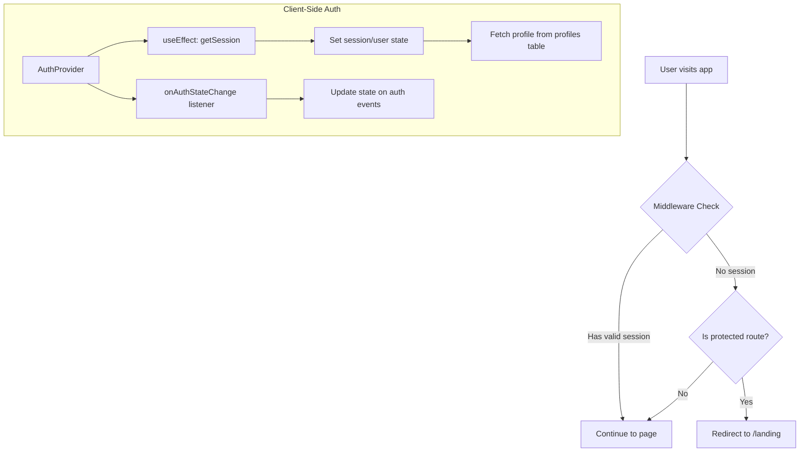
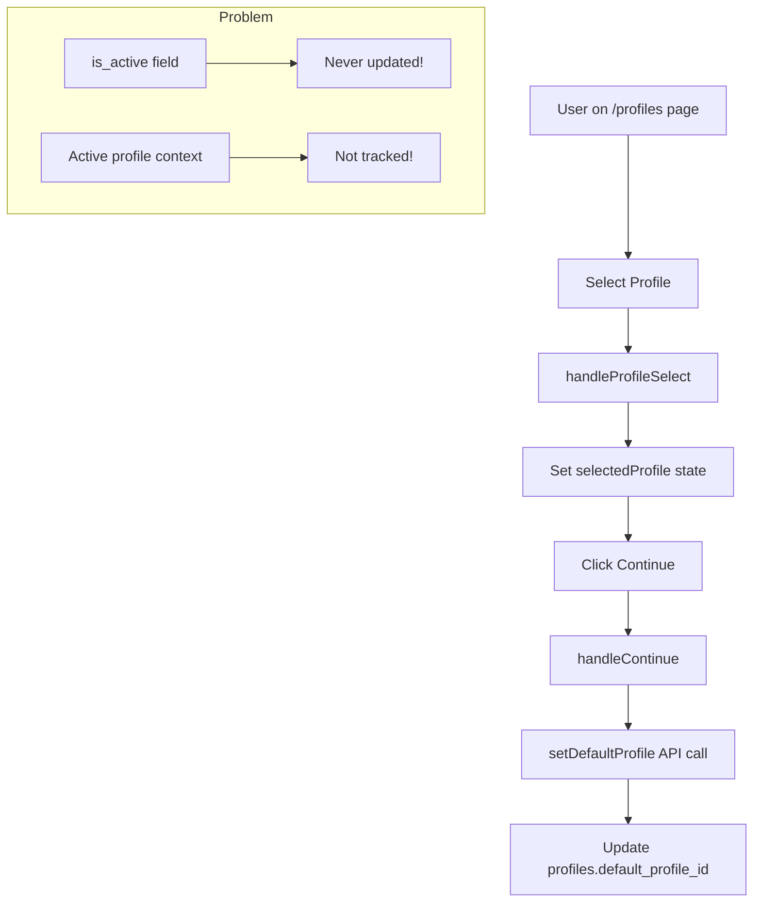
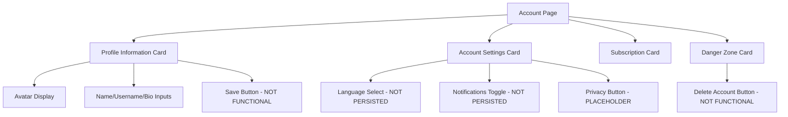

# Implementation Plan: Authentication, Profile Management, and Account Page Fixes

## Executive Summary

This document outlines the implementation plan for three critical fixes in the Stream application:
1. Session Restoration Fix
2. Profile Switching Fix  
3. Account Page Refactoring

---

## 1. Session Restoration Analysis & Implementation Plan

### Current Architecture



### Key Files Analyzed

| File | Purpose | Issues Found |
|------|---------|--------------|
| [`auth-provider.tsx`](components/providers/auth-provider.tsx) | Client-side auth context | Supabase client created on every render |
| [`middleware.ts`](middleware.ts) | Server-side auth guard | Working correctly |
| [`app/page.tsx`](app/page.tsx) | Home page with server auth | Working correctly |
| [`lib/supabase.ts`](lib/supabase.ts) | Browser client factory | Creates new instance each call |
| [`lib/supabase-server.ts`](lib/supabase-server.ts) | Server client factory | Working correctly |

### Issues Identified

1. **Non-memoized Supabase Client** (Line 41-44 in [`auth-provider.tsx`](components/providers/auth-provider.tsx:41))
   - The Supabase browser client is created inside the component without memoization
   - This causes unnecessary re-initialization on every render

2. **Session Restoration Timing**
   - The `initializeAuth` function correctly calls `getSession()` but the loading state may cause flicker

3. **Dependency Array Issue** (Line 100 in [`auth-provider.tsx`](components/providers/auth-provider.tsx:100))
   - The `useEffect` has `supabase` in dependencies, but `supabase` changes every render

### Implementation Steps

#### Step 1: Fix Supabase Client Memoization
**File:** [`components/providers/auth-provider.tsx`](components/providers/auth-provider.tsx)

```typescript
// Before (Line 41-44):
const supabase = createBrowserClient(
  process.env.NEXT_PUBLIC_SUPABASE_URL!,
  process.env.NEXT_PUBLIC_SUPABASE_ANON_KEY!
);

// After:
const supabase = useMemo(() => createBrowserClient(
  process.env.NEXT_PUBLIC_SUPABASE_URL!,
  process.env.NEXT_PUBLIC_SUPABASE_ANON_KEY!
), []);
```

#### Step 2: Update useEffect Dependencies
**File:** [`components/providers/auth-provider.tsx`](components/providers/auth-provider.tsx)

```typescript
// Update line 100 - remove supabase from dependency array
}, []); // Empty array since supabase is now memoized
```

#### Step 3: Add Session Persistence Check
**File:** [`components/providers/auth-provider.tsx`](components/providers/auth-provider.tsx)

Add explicit session restoration check in `initializeAuth`:
```typescript
const initializeAuth = async () => {
  try {
    // First check for existing session
    const { data: { session }, error } = await supabase.auth.getSession();
    
    if (error) {
      console.error('Session restore error:', error);
    }
    
    if (session) {
      setSession(session);
      setUser(session.user);
      
      // Fetch profile
      const { data: profile } = await supabase
        .from('profiles')
        .select('*')
        .eq('id', session.user.id)
        .single();
      
      setProfile(profile);
    }
  } catch (error) {
    console.error('Error initializing auth:', error);
  } finally {
    setLoading(false);
  }
};
```

---

## 2. Profile Switching Analysis & Implementation Plan

### Current Architecture



### Key Files Analyzed

| File | Purpose | Issues Found |
|------|---------|--------------|
| [`profiles/page.tsx`](app/(onboarding)/profiles/page.tsx) | Profile selection UI | Only updates `default_profile_id` |
| [`auth.ts`](app/actions/auth.ts) | Profile server actions | `is_active` not managed |
| [`auth-types.ts`](lib/auth-types.ts) | Type definitions | `is_active` field exists but unused |
| [`auth-provider.tsx`](components/providers/auth-provider.tsx) | Auth context | No active profile tracking |

### Issues Identified

1. **`is_active` Field Never Updated**
   - The `UserProfile` type has `is_active: boolean` field
   - [`getUserProfiles()`](app/actions/auth.ts:861) hardcodes `is_active` to false in the return mapping
   - No server action exists to toggle `is_active`

2. **No Active Profile Context**
   - The auth provider only tracks the main `Profile`, not the active `UserProfile`
   - When switching profiles, there's no way to know which profile is active

3. **`setDefaultProfile` Only Updates Main Profile**
   - [`setDefaultProfile()`](app/actions/auth.ts:730) only sets `default_profile_id` on the `profiles` table
   - It doesn't update `is_active` on `user_profiles`

### Implementation Steps

#### Step 1: Create `setActiveProfile` Server Action
**File:** [`app/actions/auth.ts`](app/actions/auth.ts)

Add new server action:
```typescript
/**
 * Set the active profile for the current user
 * Updates is_active flag on user_profiles table
 */
export async function setActiveProfile(profileId: string): Promise<{ 
  success: boolean; 
  error: Error | null;
  profile: UserProfile | null;
}> {
  const supabase = await createClient();
  
  const { data: { user } } = await supabase.auth.getUser();
  
  if (!user) {
    return { 
      success: false, 
      error: new Error(AUTH_ERRORS.SESSION_EXPIRED),
      profile: null
    };
  }
  
  // First, set all profiles to inactive
  await supabase
    .from('user_profiles')
    .update({ is_active: false })
    .eq('user_id', user.id);
  
  // Then set the selected profile to active
  const { data: profile, error } = await supabase
    .from('user_profiles')
    .update({ is_active: true, updated_at: new Date().toISOString() })
    .eq('id', profileId)
    .eq('user_id', user.id)
    .select()
    .single();
  
  if (error) {
    return { success: false, error, profile: null };
  }
  
  // Also update default_profile_id on main profile
  await supabase
    .from('profiles')
    .update({ 
      default_profile_id: profileId,
      updated_at: new Date().toISOString() 
    })
    .eq('id', user.id);
  
  revalidatePath('/profiles');
  revalidatePath('/');
  
  return { success: true, error: null, profile };
}
```

#### Step 2: Update `getUserProfiles` to Return Real `is_active`
**File:** [`app/actions/auth.ts`](app/actions/auth.ts:861)

```typescript
export async function getUserProfiles(): Promise<UserProfile[]> {
  const supabase = await createClient();
  
  const { data: { user } } = await supabase.auth.getUser();
  
  if (!user) {
    return [];
  }

  // Get profiles with actual is_active value
  const { data: profiles, error } = await supabase
    .from('user_profiles')
    .select('id, user_id, name, avatar_url, custom_avatar_url, is_main, is_active, pin_location, created_at, updated_at')
    .eq('user_id', user.id)
    .order('created_at', { ascending: true });
  
  if (error) {
    console.error('Error fetching profiles:', error);
    return [];
  }
  
  return (profiles || []).map(p => ({
    ...p,
    avatar_style: 'default',
    avatar_color: '',
    pin_hash: null,
    is_locked: false,
    preferences: {},
  }));
}
```

#### Step 3: Add Active Profile to AuthProvider
**File:** [`components/providers/auth-provider.tsx`](components/providers/auth-provider.tsx)

```typescript
interface AuthContextType {
  user: User | null;
  profile: Profile | null;
  activeUserProfile: UserProfile | null;  // Add this
  session: Session | null;
  loading: boolean;
  // ... existing methods
  setActiveProfile: (profileId: string) => Promise<{ error: Error | null }>;  // Add this
}
```

Add state and method:
```typescript
const [activeUserProfile, setActiveUserProfile] = useState<UserProfile | null>(null);

// In initializeAuth and onAuthStateChange, fetch active profile:
if (session?.user) {
  const { data: profiles } = await supabase
    .from('user_profiles')
    .select('*')
    .eq('user_id', session.user.id)
    .eq('is_active', true)
    .single();
  
  setActiveUserProfile(profiles);
}

// Add setActiveProfile method:
const handleSetActiveProfile = async (profileId: string) => {
  const result = await setActiveProfile(profileId);
  if (result.profile) {
    setActiveUserProfile(result.profile);
  }
  return { error: result.error };
};
```

#### Step 4: Update Profiles Page to Use New Action
**File:** [`app/(onboarding)/profiles/page.tsx`](app/(onboarding)/profiles/page.tsx:208)

```typescript
// Update handleContinue:
const handleContinue = async () => {
  if (!selectedProfile) return;
  
  setSaving(true);
  
  // Use the new setActiveProfile action
  const result = await setActiveProfile(selectedProfile.id);
  
  if (result.error) {
    setError(result.error.message);
    setSaving(false);
    return;
  }
  
  if (isOnboardingMode) {
    await updateOnboardingStep('preferences');
    await refreshProfile();
    router.push('/taste');
  } else {
    await refreshProfile();
    router.push('/');
  }
  router.refresh();
};
```

---

## 3. Account Page Refactoring Analysis & Implementation Plan

### Current Architecture



### Key Files Analyzed

| File | Purpose | Issues Found |
|------|---------|--------------|
| [`account/page.tsx`](app/account/page.tsx) | Account settings UI | No form functionality |
| [`auth.ts`](app/actions/auth.ts) | Auth server actions | Missing account update actions |
| [`auth-types.ts`](lib/auth-types.ts) | Type definitions | Missing language preference type |

### Issues Identified

1. **No Save Functionality for Profile Updates**
   - Inputs have `defaultValue` but no controlled state
   - Save button has no `onClick` handler

2. **No Language Preference Persistence**
   - Language select is static with no save mechanism
   - No `language` field in `Profile` type

3. **No Notification Preference Persistence**
   - Toggle is purely visual

4. **No Delete Account Functionality**
   - Button exists but has no action

### Implementation Steps

#### Step 1: Create Account Update Server Actions
**File:** [`app/actions/auth.ts`](app/actions/auth.ts)

```typescript
/**
 * Update user account information
 */
export async function updateAccountInfo(data: {
  full_name?: string;
  username?: string;
  bio?: string;
}): Promise<{ profile: Profile | null; error: Error | null }> {
  const supabase = await createClient();
  
  const { data: { user } } = await supabase.auth.getUser();
  
  if (!user) {
    return { profile: null, error: new Error(AUTH_ERRORS.SESSION_EXPIRED) };
  }
  
  const { data: profile, error } = await supabase
    .from('profiles')
    .update({
      ...data,
      updated_at: new Date().toISOString(),
    })
    .eq('id', user.id)
    .select()
    .single();
  
  if (error) {
    return { profile: null, error };
  }
  
  revalidatePath('/account');
  
  return { profile, error: null };
}

/**
 * Update user preferences
 */
export async function updateUserPreferences(data: {
  language?: string;
  notifications?: boolean;
}): Promise<{ profile: Profile | null; error: Error | null }> {
  const supabase = await createClient();
  
  const { data: { user } } = await supabase.auth.getUser();
  
  if (!user) {
    return { profile: null, error: new Error(AUTH_ERRORS.SESSION_EXPIRED) };
  }
  
  // Get current preferences and merge
  const { data: currentProfile } = await supabase
    .from('profiles')
    .select('preferences')
    .eq('id', user.id)
    .single();
  
  const updatedPreferences = {
    ...(currentProfile?.preferences || {}),
    ...data,
  };
  
  const { data: profile, error } = await supabase
    .from('profiles')
    .update({
      preferences: updatedPreferences,
      updated_at: new Date().toISOString(),
    })
    .eq('id', user.id)
    .select()
    .single();
  
  if (error) {
    return { profile: null, error };
  }
  
  revalidatePath('/account');
  
  return { profile, error: null };
}

/**
 * Delete user account and all associated data
 */
export async function deleteAccount(): Promise<{ 
  success: boolean; 
  error: Error | null 
}> {
  const supabase = await createClient();
  
  const { data: { user } } = await supabase.auth.getUser();
  
  if (!user) {
    return { success: false, error: new Error(AUTH_ERRORS.SESSION_EXPIRED) };
  }
  
  // Delete user_profiles (household profiles)
  await supabase
    .from('user_profiles')
    .delete()
    .eq('user_id', user.id);
  
  // Delete content preferences
  await supabase
    .from('content_preferences')
    .delete()
    .eq('user_id', user.id);
  
  // Delete watch history
  await supabase
    .from('watch_history')
    .delete()
    .eq('user_id', user.id);
  
  // Delete watchlist
  await supabase
    .from('watchlist')
    .delete()
    .eq('user_id', user.id);
  
  // Delete main profile
  await supabase
    .from('profiles')
    .delete()
    .eq('id', user.id);
  
  // Delete auth user (requires admin API or Supabase edge function)
  // Note: This may need to be done via a Supabase Edge Function
  // For now, sign out the user
  await supabase.auth.signOut();
  
  revalidatePath('/');
  redirect('/');
  
  return { success: true, error: null };
}
```

#### Step 2: Update Profile Type for Preferences
**File:** [`lib/auth-types.ts`](lib/auth-types.ts)

```typescript
export interface ProfilePreferences {
  language?: string;
  notifications?: boolean;
  // Add other preferences as needed
}

export interface Profile {
  // ... existing fields
  preferences: ProfilePreferences;  // Update type
  // ... rest of fields
}
```

#### Step 3: Refactor Account Page with Form State
**File:** [`app/account/page.tsx`](app/account/page.tsx)

Key changes needed:
1. Add form state management with `useState`
2. Add form submission handlers
3. Add loading states for each section
4. Add success/error toast notifications
5. Implement delete account confirmation dialog

```typescript
// Add state for form fields
const [fullName, setFullName] = useState(profile?.full_name || '');
const [username, setUsername] = useState(profile?.username || '');
const [bio, setBio] = useState(profile?.bio || '');
const [language, setLanguage] = useState(
  (profile?.preferences as ProfilePreferences)?.language || 'en'
);
const [notifications, setNotifications] = useState(
  (profile?.preferences as ProfilePreferences)?.notifications ?? true
);
const [saving, setSaving] = useState(false);
const [showDeleteDialog, setShowDeleteDialog] = useState(false);

// Add save handlers
const handleSaveProfile = async () => {
  setSaving(true);
  const result = await updateAccountInfo({ full_name: fullName, username, bio });
  if (result.error) {
    // Show error toast
  } else {
    // Show success toast
    refreshProfile();
  }
  setSaving(false);
};

const handleSavePreferences = async () => {
  setSaving(true);
  const result = await updateUserPreferences({ language, notifications });
  if (result.error) {
    // Show error toast
  } else {
    // Show success toast
    refreshProfile();
  }
  setSaving(false);
};

const handleDeleteAccount = async () => {
  setSaving(true);
  const result = await deleteAccount();
  if (result.error) {
    // Show error toast
  }
  setSaving(false);
};
```

#### Step 4: Add Delete Account Confirmation Dialog
**File:** [`app/account/page.tsx`](app/account/page.tsx)

Use the existing AlertDialog component:
```typescript
<AlertDialog open={showDeleteDialog} onOpenChange={setShowDeleteDialog}>
  <AlertDialogContent>
    <AlertDialogHeader>
      <AlertDialogTitle>Delete Account</AlertDialogTitle>
      <AlertDialogDescription>
        This action cannot be undone. This will permanently delete your account
        and remove all your data from our servers.
      </AlertDialogDescription>
    </AlertDialogHeader>
    <AlertDialogFooter>
      <AlertDialogCancel>Cancel</AlertDialogCancel>
      <AlertDialogAction 
        onClick={handleDeleteAccount}
        className="bg-red-600 hover:bg-red-700"
      >
        Delete Account
      </AlertDialogAction>
    </AlertDialogFooter>
  </AlertDialogContent>
</AlertDialog>
```

---

## Implementation Order

The recommended implementation order based on dependencies:

1. **Session Restoration Fix** (Foundation)
   - Fix Supabase client memoization
   - Update useEffect dependencies
   - Test session persistence

2. **Profile Switching Fix** (Depends on Session)
   - Create `setActiveProfile` server action
   - Update `getUserProfiles` to return real `is_active`
   - Add active profile to AuthProvider
   - Update profiles page

3. **Account Page Refactoring** (Independent)
   - Create account update server actions
   - Update Profile type
   - Refactor account page with form state
   - Add delete account confirmation

---

## Potential Risks & Dependencies

### Session Restoration
- **Risk:** Changes to auth provider may affect all authenticated routes
- **Mitigation:** Test thoroughly on all protected pages after changes

### Profile Switching
- **Risk:** Database migration may be needed if `is_active` column doesn't exist
- **Dependency:** Verify `user_profiles` table has `is_active` column
- **Risk:** Existing users may have no active profile set
- **Mitigation:** Add logic to auto-select first profile if none active

### Account Page
- **Risk:** Delete account may need Supabase Edge Function for full auth user deletion
- **Dependency:** Check Supabase project settings for auth user deletion capabilities
- **Risk:** Language preference may need i18n library integration
- **Mitigation:** Store preference for now, implement i18n later

---

## Testing Checklist

### Session Restoration
- [ ] User remains logged in after page refresh
- [ ] User remains logged in after closing and reopening browser
- [ ] Session expires gracefully and redirects to login
- [ ] Profile data loads correctly on session restore

### Profile Switching
- [ ] User can select a profile
- [ ] Active profile persists across page navigation
- [ ] Active profile persists after page refresh
- [ ] Only one profile is active at a time
- [ ] Profile-specific content displays correctly

### Account Page
- [ ] User can update name, username, bio
- [ ] Changes persist after page refresh
- [ ] Language preference saves correctly
- [ ] Notification preference saves correctly
- [ ] Delete account shows confirmation dialog
- [ ] Delete account removes all user data
