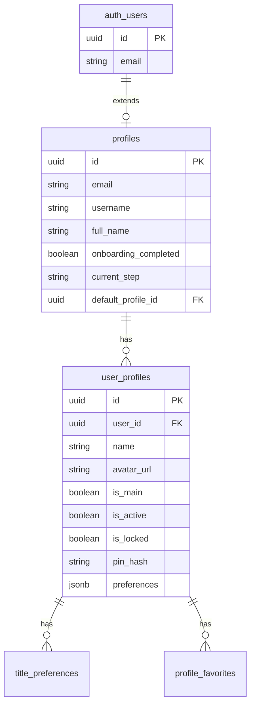
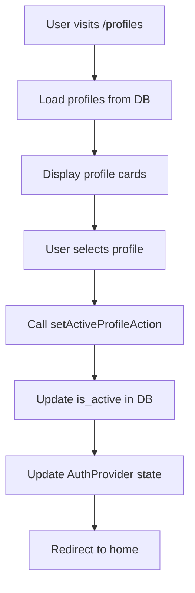
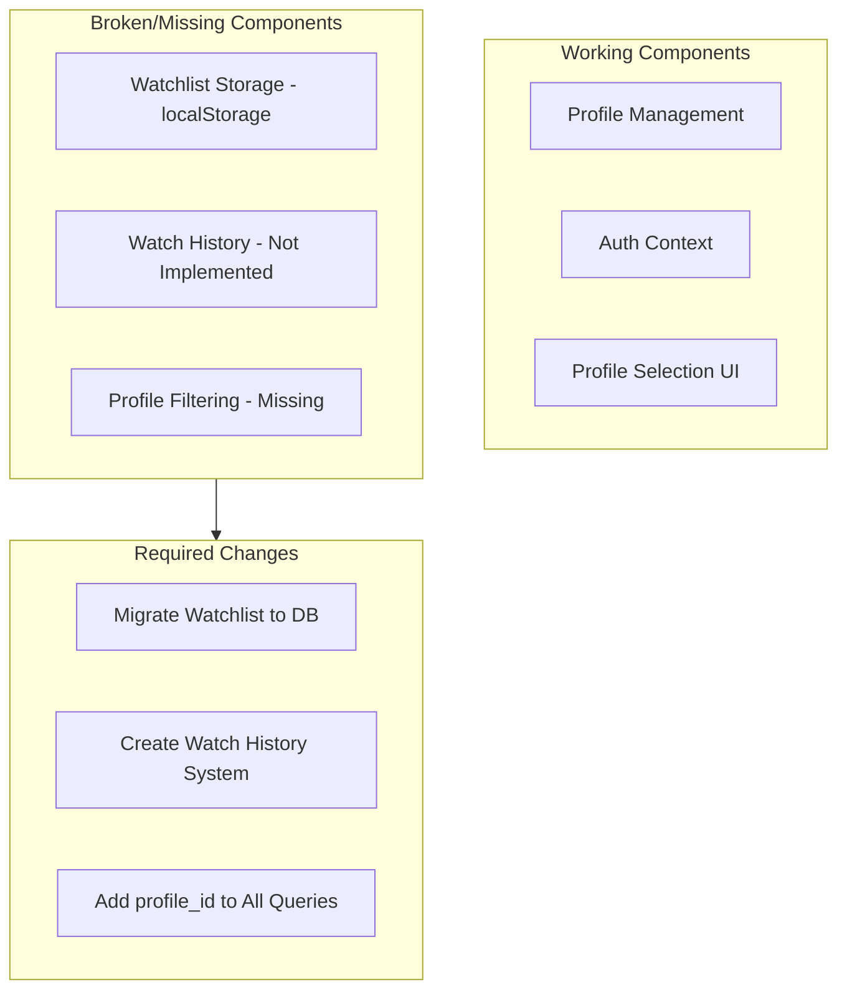
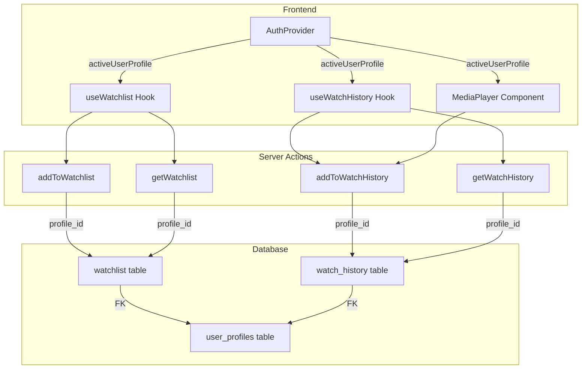

# Profile Data Segregation Analysis

## Executive Summary

This analysis examines the current architecture for implementing strict data segregation for user profiles. The goal is to ensure each profile maintains a unique Watchlist (saved movies and TV shows) and Watch History (streaming activity).

**Key Findings:**
1. **Watchlist is NOT connected to the database** - Currently uses localStorage only
2. **Watch History does NOT exist** - No implementation found in codebase or database
3. **Profile infrastructure exists** - Database schema and auth context support profile segregation
4. **Significant gaps require implementation** - Both features need to be built from scratch

---

## 1. Profile Management System

### Current Architecture

The profile management system follows a Netflix-style household profile model:



### Profile Storage and Selection

**Database Tables:**
- [`profiles`](supabase/migrations/001_initial_schema.sql:34) - Main user account (1:1 with auth.users)
- [`user_profiles`](supabase/migrations/001_initial_schema.sql:71) - Sub-profiles for household members

**Active Profile Tracking:**
- Active profile is stored via `is_active` boolean in `user_profiles` table
- [`setActiveProfileAction`](app/actions/auth.ts:11) server action manages profile switching
- [`activeUserProfile`](components/providers/auth-provider.tsx:24) state in AuthProvider context

**Profile Selection Flow:**


**Key Files:**
- [`app/(onboarding)/profiles/page.tsx`](app/(onboarding)/profiles/page.tsx) - Profile selection UI
- [`components/providers/auth-provider.tsx`](components/providers/auth-provider.tsx) - Auth context with `activeUserProfile`
- [`lib/auth-types.ts`](lib/auth-types.ts:55) - `UserProfile` type definition

---

## 2. Watchlist Implementation

### Current State: CRITICAL GAP

**The watchlist feature is NOT connected to the database.**

The current implementation in [`hooks/use-watchlist.ts`](hooks/use-watchlist.ts) uses **localStorage only**:

```typescript
// Current implementation - localStorage only
const saveMovie = (movie: Movie) => {
    setSavedMovies((prev) => {
        const updated = [...prev, movie];
        localStorage.setItem("watchlist", JSON.stringify(updated)); // ❌ Local storage
        return updated;
    });
};
```

### Database Schema Exists But Unused

The database has a `watchlist` table defined in [`lib/auth-types.ts`](lib/auth-types.ts:107):

```typescript
export interface WatchlistItem {
  id: string;
  user_id: string;
  profile_id: string | null;  // ✅ Supports profile segregation
  tmdb_id: number;
  content_type: ContentType;
  created_at: string;
}
```

Server actions exist in [`app/actions/auth.ts`](app/actions/auth.ts:1288):
- `addToWatchlist(tmdbId, contentType)` - ❌ Missing profile_id parameter
- `removeFromWatchlist(tmdbId)` - ❌ Missing profile_id parameter
- `getWatchlist()` - ❌ Missing profile_id filter

### Gap Analysis

| Component | Status | Issue |
|-----------|--------|-------|
| Database table | ⚠️ Exists | May need migration to add profile_id |
| Server actions | ⚠️ Partial | Missing profile_id parameter |
| Frontend hook | ❌ Broken | Uses localStorage, not database |
| Saved page | ❌ Broken | Uses localStorage hook |
| Profile filtering | ❌ Missing | No profile-based queries |

---

## 3. Watch History Implementation

### Current State: NOT IMPLEMENTED

**No watch history functionality exists in the codebase.**

**Missing Components:**
1. No database table for watch history
2. No server actions for recording/retrieving history
3. No frontend integration in media player
4. No UI for viewing watch history

### Type Definition Exists

The type is defined in [`lib/auth-types.ts`](lib/auth-types.ts:90):

```typescript
export interface WatchHistoryItem {
  id: string;
  user_id: string;
  profile_id: string | null;  // ✅ Supports profile segregation
  tmdb_id: number;
  content_type: ContentType;
  season_number: number | null;
  episode_number: number | null;
  progress: number;           // Percentage watched
  completed: boolean;
  last_watched_at: string;
  created_at: string;
}
```

### Media Player Analysis

The [`MediaPlayer`](components/media-player.tsx:57) component handles video playback but has **no watch history tracking**:

```typescript
// MediaPlayer receives content info but doesn't track history
interface MediaPlayerProps {
    mediaId: number;
    type: "movie" | "tv";
    title: string;
    season?: number;
    episode?: number;
    runtime?: number;
    preferredProvider?: string;
}
// ❌ No progress tracking
// ❌ No history recording
// ❌ No resume functionality
```

---

## 4. Database Schema Analysis

### Existing Tables

| Table | Purpose | Profile Support |
|-------|---------|-----------------|
| `profiles` | Main user account | N/A |
| `user_profiles` | Household profiles | ✅ Core table |
| `title_preferences` | Taste picker data | ✅ Has profile_id FK |
| `profile_favorites` | Favorite titles | ✅ Has profile_id FK |
| `content_preferences` | Likes/dislikes | ✅ Has profile_id column |
| `watchlist` | Saved titles | ⚠️ Has nullable profile_id |
| `watch_history` | Viewing history | ❌ Does not exist |

### Required Migrations

1. **Create `watch_history` table** - Does not exist
2. **Update `watchlist` table** - Ensure profile_id is properly constrained
3. **Add RLS policies** - For new watch_history table

---

## 5. Authentication & User Context

### AuthProvider Structure

The [`AuthProvider`](components/providers/auth-provider.tsx:44) provides:

```typescript
interface AuthContextType {
  user: User | null;                    // Supabase auth user
  profile: Profile | null;              // Main user profile
  session: Session | null;              // Auth session
  activeUserProfile: UserProfile | null; // ✅ Currently active profile
  loading: boolean;
  // ... methods
}
```

### Accessing Active Profile

```typescript
const { activeUserProfile } = useAuth();

// Usage in components
const profileId = activeUserProfile?.id;
const userId = user?.id;
```

---

## 6. Identified Gaps for Profile Data Segregation

### Critical Gaps



### Gap Summary

| Feature | Current State | Required Action |
|---------|---------------|-----------------|
| Watchlist storage | localStorage | Migrate to database |
| Watchlist profile filter | None | Add profile_id filtering |
| Watch history | Non-existent | Full implementation |
| Progress tracking | Non-existent | Implement in media player |
| Resume playback | Non-existent | Implement with history |

---

## 7. Recommended Changes

### Phase 1: Database Schema Updates

1. **Create `watch_history` table:**
   ```sql
   CREATE TABLE public.watch_history (
       id UUID PRIMARY KEY DEFAULT uuid_generate_v4(),
       user_id UUID NOT NULL REFERENCES public.profiles(id) ON DELETE CASCADE,
       profile_id UUID NOT NULL REFERENCES public.user_profiles(id) ON DELETE CASCADE,
       tmdb_id INTEGER NOT NULL,
       content_type TEXT NOT NULL CHECK (content_type IN ('movie', 'tv')),
       season_number INTEGER,
       episode_number INTEGER,
       progress DECIMAL(5,2) DEFAULT 0,
       completed BOOLEAN DEFAULT FALSE,
       last_watched_at TIMESTAMPTZ DEFAULT NOW(),
       created_at TIMESTAMPTZ DEFAULT NOW(),
       UNIQUE(profile_id, tmdb_id, COALESCE(season_number, 0), COALESCE(episode_number, 0))
   );
   ```

2. **Update `watchlist` table constraints:**
   ```sql
   ALTER TABLE public.watchlist 
   ALTER COLUMN profile_id SET NOT NULL;
   ```

### Phase 2: Server Actions

1. **Update watchlist actions** to accept and filter by `profile_id`
2. **Create watch history actions:**
   - `addToWatchHistory(profileId, tmdbId, contentType, progress, season?, episode?)`
   - `getWatchHistory(profileId)`
   - `updateWatchProgress(historyId, progress)`
   - `getContinueWatching(profileId)`

### Phase 3: Frontend Updates

1. **Replace `use-watchlist.ts`** with database-backed implementation
2. **Update `saved/page.tsx`** to use new hook with profile filtering
3. **Add progress tracking** to `MediaPlayer` component
4. **Create watch history UI** component

### Phase 4: Integration

1. **Update all watchlist/history queries** to include `profile_id`
2. **Add profile context** to all relevant components
3. **Implement resume playback** functionality

---

## 8. Implementation Priority

### High Priority (Required for Data Segregation)

1. Create `watch_history` database table
2. Update `watchlist` table with proper profile_id constraints
3. Rewrite `use-watchlist.ts` to use database
4. Create watch history server actions
5. Update saved page to filter by profile

### Medium Priority (Enhanced Features)

1. Add progress tracking to media player
2. Implement resume playback
3. Create watch history UI page
4. Add continue watching section

### Low Priority (Polish)

1. Add RLS policies for watch_history
2. Optimize queries with indexes
3. Add real-time sync across devices

---

## 9. Architecture Diagram - Proposed



---

## Conclusion

The current architecture has a solid foundation for profile management but critically lacks the implementation of profile-specific data storage for watchlist and watch history. The watchlist feature is currently broken (using localStorage instead of the database), and watch history does not exist at all.

**Immediate action required:**
1. Migrate watchlist from localStorage to database with profile filtering
2. Implement complete watch history system from scratch
3. Update all data queries to filter by active profile

The existing database schema, auth context, and profile management provide a good foundation for implementing these features with proper data segregation.
