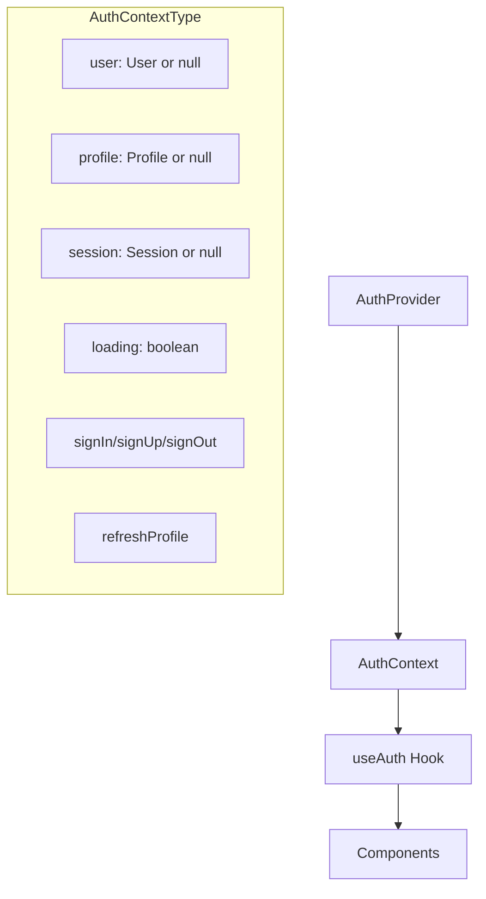
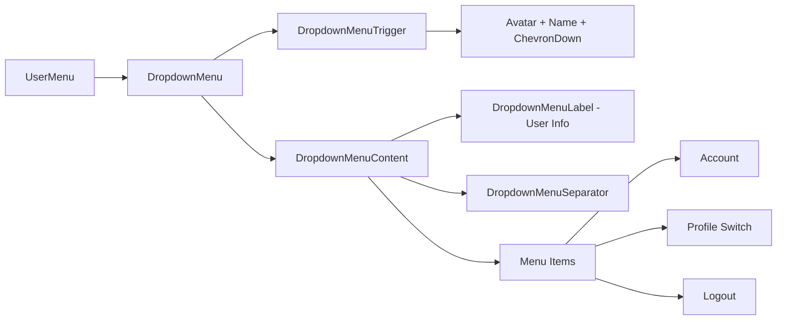
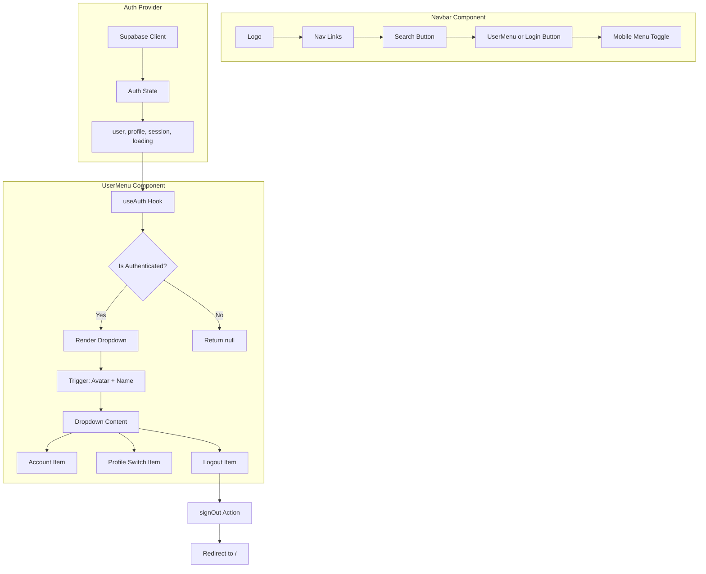

# User Profile Widget Integration - Design Document

## Executive Summary

This document analyzes the current architecture for integrating a dynamic user profile widget into the navbar. The analysis reveals that a [`UserMenu`](components/user-menu.tsx:25) component already exists with most required functionality. The recommended approach is to **enhance the existing component** rather than create a new one, with minor adjustments to match the exact requirements.

---

## 1. Architecture Analysis Findings

### 1.1 Current Navbar Structure

**File**: [`components/navbar.tsx`](components/navbar.tsx:26)

The navbar uses a "floating pill" design with the following layout:

```
┌─────────────────────────────────────────────────────────────────────────┐
│  [Logo]  [Nav Links: Home | Movies | TV | Genres | Saved | Year]       │
│                              [Search Btn] [UserMenu/Login] [Mobile]     │
└─────────────────────────────────────────────────────────────────────────┘
```

**Key Structure Points**:
- **Lines 67-68**: Fixed positioning with glassmorphism styling (`bg-black/60 backdrop-blur-md`)
- **Lines 83-106**: Desktop navigation links
- **Lines 108-142**: Right side section containing:
  - **Search button** (lines 110-116): Gradient styled button that opens [`SearchModal`](components/search-modal.tsx)
  - **UserMenu** (lines 118-121): Conditionally rendered when `!loading && user`
  - **Login button** (lines 123-134): Conditionally rendered when `!loading && !user`
  - **Mobile menu toggle** (lines 136-141)

**Search Bar Location**: The search button is positioned at line 110-116, immediately before the UserMenu component.

### 1.2 Authentication State Management

**File**: [`components/providers/auth-provider.tsx`](components/providers/auth-provider.tsx:34)

The authentication system uses React Context with Supabase:



**Key Exports from [`useAuth()`](components/providers/auth-provider.tsx:167)**:
| Property | Type | Description |
|----------|------|-------------|
| `user` | `User \| null` | Supabase auth user object |
| `profile` | `Profile \| null` | Custom profile from `profiles` table |
| `session` | `Session \| null` | Current session |
| `loading` | `boolean` | Initial auth state loading |
| `signOut` | `() => Promise<void>` | Sign out function |

**Profile Interface** ([`lib/auth-types.ts`](lib/auth-types.ts:37)):
```typescript
interface Profile {
  id: string;
  email: string;
  username: string | null;
  full_name: string | null;
  avatar_url: string | null;
  bio: string | null;
  onboarding_completed: boolean;
  // ... additional fields
}
```

### 1.3 Existing UserMenu Component Analysis

**File**: [`components/user-menu.tsx`](components/user-menu.tsx:25)

The existing component already provides:

| Feature | Status | Implementation |
|---------|--------|----------------|
| Auth detection | ✅ Complete | Uses `useAuth()` hook (line 27) |
| Avatar display | ✅ Complete | [`Avatar`](components/ui/avatar.tsx:8) component with fallback initials (lines 75-80) |
| Display name | ✅ Complete | Shown next to avatar (lines 81-83) |
| Dropdown menu | ✅ Complete | Uses [`DropdownMenu`](components/ui/dropdown-menu.tsx:9) from Radix UI |
| Hover states | ✅ Complete | Tailwind classes on trigger button (line 73) |
| Sign out | ✅ Complete | Calls `signOut()` and redirects (lines 49-53) |

**Current Dropdown Menu Items** (lines 112-152):
1. **Manage Profiles** → `/profiles` (Pencil icon)
2. **Account** → `/account` (User icon)
3. **Settings** → `/settings` (Settings icon)
4. **Help Center** → `/help` (HelpCircle icon)
5. **Sign Out** → Calls `signOut()` (LogOut icon, red colored)

### 1.4 Available UI Components

**DropdownMenu** ([`components/ui/dropdown-menu.tsx`](components/ui/dropdown-menu.tsx:9)):
- Built on Radix UI primitives
- Exports: `DropdownMenu`, `DropdownMenuTrigger`, `DropdownMenuContent`, `DropdownMenuItem`, `DropdownMenuLabel`, `DropdownMenuSeparator`
- Supports `variant` prop: `'default' | 'destructive'`

**Avatar** ([`components/ui/avatar.tsx`](components/ui/avatar.tsx:8)):
- Built on Radix UI primitives
- Exports: `Avatar`, `AvatarImage`, `AvatarFallback`
- Already styled with rounded-full and proper sizing

---

## 2. Gap Analysis

### Requirements vs Current Implementation

| Requirement | Current State | Action Needed |
|-------------|---------------|---------------|
| Auto-detect auth status | ✅ Implemented | None |
| Display avatar when signed in | ✅ Implemented | None |
| Display name when signed in | ✅ Implemented | None |
| Dropdown on interaction | ✅ Implemented | None |
| "Account" menu item | ✅ Exists | Verify route exists |
| "Profile Switch" menu item | ⚠️ Different label | Rename "Manage Profiles" to "Profile Switch" |
| "Logout" menu item | ✅ Exists as "Sign Out" | Consider renaming to "Logout" |
| Hover states | ✅ Implemented | None |
| Position adjacent to search | ✅ Already positioned | None |

### Routes Verification Needed

The following routes are referenced but need verification:
- `/account` - Account settings page
- `/profiles` - Profile management/switching page
- `/settings` - Settings page
- `/help` - Help center page

---

## 3. Recommended Implementation Approach

### Decision: Modify Existing `user-menu.tsx`

**Rationale**:
1. The existing component already implements 90% of the requirements
2. It uses the correct UI components (Avatar, DropdownMenu)
3. It properly integrates with the auth provider
4. It's already integrated into the navbar at the correct position
5. Creating a new component would duplicate code and increase maintenance burden

### Proposed Changes

#### 3.1 Simplify Menu Items

Change from 5 items to 3 items as specified:

**Current**:
```
Manage Profiles → /profiles
Account → /account
Settings → /settings
Help Center → /help
Sign Out
```

**Proposed**:
```
Account → /account
Profile Switch → /profiles
Logout → signOut()
```

#### 3.2 Component Structure

The component structure remains unchanged:



---

## 4. Component Design Specification

### 4.1 Modified UserMenu Component

**File**: `components/user-menu.tsx`

**Props**: None (uses `useAuth()` hook internally)

**State**:
- `isOpen: boolean` - Controls dropdown visibility

**Menu Items Specification**:

| Label | Icon | Route | Action |
|-------|------|-------|--------|
| Account | `User` | `/account` | Navigate to account settings |
| Profile Switch | `Users` or `Pencil` | `/profiles` | Navigate to profile switching page |
| Logout | `LogOut` | N/A | Call `signOut()`, redirect to `/` |

### 4.2 Visual Design

**Trigger Button** (current styling preserved):
```css
flex items-center gap-2 px-3 py-2 h-auto rounded-full 
hover:bg-white/10 transition-colors
```

**Avatar**:
- Size: `w-8 h-8` (32px)
- Border: `border-2 border-transparent`
- Fallback: Red background with white initials

**Display Name**:
- Hidden on small screens: `hidden sm:inline-block`
- Max width: `max-w-[100px]` with truncation

**Dropdown Content**:
- Alignment: `end` (right-aligned)
- Width: `w-56`
- Background: `bg-zinc-900 border-zinc-800`

### 4.3 Integration Points in Navbar

**File**: `components/navbar.tsx`

**Current Position** (lines 118-121):
```tsx
{!loading && user && (
  <UserMenu />
)}
```

**No changes needed** - the component is already positioned immediately after the search button.

---

## 5. Implementation Checklist

### Phase 1: Modify UserMenu Component
- [ ] Remove unused menu items (Settings, Help Center)
- [ ] Rename "Manage Profiles" to "Profile Switch"
- [ ] Rename "Sign Out" to "Logout"
- [ ] Update icon imports (remove Settings, HelpCircle; keep User, LogOut, Pencil or use Users)
- [ ] Verify dropdown styling matches design system

### Phase 2: Verify Routes
- [ ] Confirm `/account` route exists or create placeholder
- [ ] Confirm `/profiles` route exists (already exists at `app/(onboarding)/profiles/page.tsx`)

### Phase 3: Testing
- [ ] Test dropdown opens/closes correctly
- [ ] Test navigation to Account page
- [ ] Test navigation to Profile Switch page
- [ ] Test logout functionality
- [ ] Test hover states on trigger button
- [ ] Test responsive behavior (name hidden on mobile)
- [ ] Test avatar fallback with initials

---

## 6. Code Changes Summary

### 6.1 `components/user-menu.tsx` Changes

**Imports to modify**:
```tsx
// Remove: Settings, HelpCircle
// Keep: User, LogOut, ChevronDown
// Add or change: Users (for Profile Switch) or keep Pencil
import {
  User,
  LogOut,
  ChevronDown,
  Users,  // New icon for Profile Switch
} from "lucide-react";
```

**Menu items to modify** (lines 112-152):
```tsx
{/* Account - Keep */}
<DropdownMenuItem
  className="cursor-pointer focus:bg-zinc-800 focus:text-white"
  onClick={() => router.push("/account")}
>
  <User className="mr-2 h-4 w-4" />
  <span>Account</span>
</DropdownMenuItem>

{/* Profile Switch - Rename from Manage Profiles */}
<DropdownMenuItem
  className="cursor-pointer focus:bg-zinc-800 focus:text-white"
  onClick={() => router.push("/profiles")}
>
  <Users className="mr-2 h-4 w-4" />
  <span>Profile Switch</span>
</DropdownMenuItem>

<DropdownMenuSeparator className="bg-zinc-800" />

{/* Logout - Rename from Sign Out */}
<DropdownMenuItem
  className="cursor-pointer focus:bg-zinc-800 focus:text-red-400 text-red-400"
  onClick={handleSignOut}
>
  <LogOut className="mr-2 h-4 w-4" />
  <span>Logout</span>
</DropdownMenuItem>
```

### 6.2 No Changes Required

- `components/navbar.tsx` - Already correctly integrated
- `components/providers/auth-provider.tsx` - Already provides needed auth state
- `components/ui/dropdown-menu.tsx` - Already has needed functionality
- `components/ui/avatar.tsx` - Already has needed functionality

---

## 7. Architecture Diagram



---

## 8. Conclusion

The existing [`UserMenu`](components/user-menu.tsx:25) component already implements the core functionality required for the user profile widget. The recommended approach is to make minimal modifications:

1. **Simplify menu items** from 5 to 3 (Account, Profile Switch, Logout)
2. **Rename labels** to match exact requirements
3. **Update icons** as needed

No structural changes to the navbar or authentication system are required. The component is already positioned correctly adjacent to the search bar and properly integrates with the existing auth provider.
