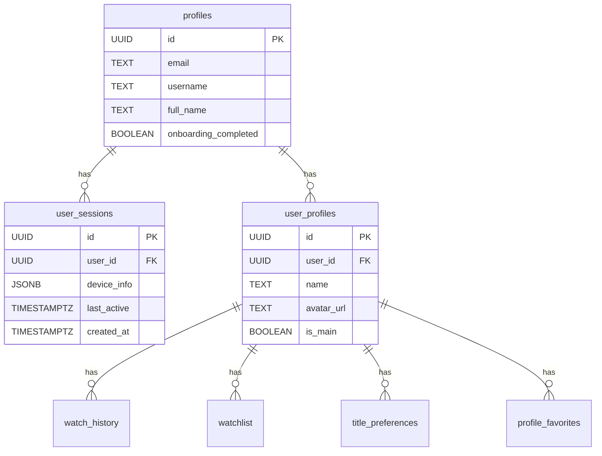

# User Sessions Expanded Query Design

## Overview

This document outlines the analysis of the existing user sessions schema and provides design recommendations for expanding the query to include additional attributes for device tracking, browser details, IP address, network quality, session duration, and operating system information.

---

## 1. Current Schema Analysis

### 1.1 Existing `user_sessions` Table

The current [`user_sessions`](supabase/migrations/001_initial_schema.sql:126) table has the following structure:

```sql
CREATE TABLE public.user_sessions (
    id UUID PRIMARY KEY DEFAULT uuid_generate_v4(),
    user_id UUID NOT NULL REFERENCES public.profiles(id) ON DELETE CASCADE,
    device_info JSONB DEFAULT '{}'::jsonb,
    last_active TIMESTAMPTZ DEFAULT NOW() NOT NULL,
    created_at TIMESTAMPTZ DEFAULT NOW() NOT NULL
);
```

### 1.2 Current Columns

| Column | Type | Description |
|--------|------|-------------|
| `id` | UUID | Primary key |
| `user_id` | UUID | Foreign key to [`profiles`](supabase/migrations/001_initial_schema.sql:34) table |
| `device_info` | JSONB | JSON object for device information - currently unstructured |
| `last_active` | TIMESTAMPTZ | Last activity timestamp |
| `created_at` | TIMESTAMPTZ | Session creation timestamp |

### 1.3 Existing Indexes

```sql
CREATE INDEX IF NOT EXISTS idx_user_sessions_user_id ON public.user_sessions(user_id);
CREATE INDEX IF NOT EXISTS idx_user_sessions_last_active ON public.user_sessions(last_active);
```

### 1.4 Related Tables



---

## 2. Gap Analysis

### 2.1 Required Attributes vs Current Schema

| Required Attribute | Current Status | Gap |
|-------------------|----------------|-----|
| Device Type | Partially in JSONB | Not queryable/indexed |
| Device Model | Not captured | Missing |
| Device Brand | Not captured | Missing |
| Browser Name | Partially in JSONB | Not queryable/indexed |
| Browser Version | Partially in JSONB | Not queryable/indexed |
| IP Address | Not captured | Missing |
| Network Quality | Not captured | Missing |
| Session Duration | Calculable | Needs query logic |
| Operating System | Partially in JSONB | Not queryable/indexed |
| OS Version | Not captured | Missing |

### 2.2 Current JSONB Structure Limitations

The current `device_info` JSONB column stores data flexibly but has several limitations:

1. **No schema enforcement** - Data structure can vary between sessions
2. **No indexing** - Cannot efficiently query specific device attributes
3. **No type safety** - Application layer must handle parsing
4. **Limited analytics** - Difficult to aggregate by device type, browser, etc.

---

## 3. Proposed Schema Changes

### 3.1 Option A: Structured Columns (Recommended)

Add explicit columns for each attribute to enable indexing and efficient querying:

```sql
ALTER TABLE public.user_sessions
    -- Device Information
    ADD COLUMN device_type TEXT,
    ADD COLUMN device_model TEXT,
    ADD COLUMN device_brand TEXT,
    
    -- Browser Details
    ADD COLUMN browser_name TEXT,
    ADD COLUMN browser_version TEXT,
    
    -- Operating System
    ADD COLUMN os_name TEXT,
    ADD COLUMN os_version TEXT,
    
    -- Network Information
    ADD COLUMN ip_address INET,
    ADD COLUMN network_type TEXT,
    ADD COLUMN connection_speed TEXT,
    
    -- Session Tracking
    ADD COLUMN ended_at TIMESTAMPTZ,
    ADD COLUMN is_active BOOLEAN DEFAULT TRUE,
    
    -- Raw user agent for reference
    ADD COLUMN user_agent TEXT;
```

### 3.2 Option B: Hybrid Approach

Keep JSONB for flexible data while adding key columns for querying:

```sql
ALTER TABLE public.user_sessions
    -- Key queryable columns
    ADD COLUMN device_type TEXT,
    ADD COLUMN browser_name TEXT,
    ADD COLUMN os_name TEXT,
    ADD COLUMN ip_address INET,
    ADD COLUMN is_active BOOLEAN DEFAULT TRUE,
    ADD COLUMN ended_at TIMESTAMPTZ,
    
    -- Keep detailed info in JSONB
    ADD COLUMN network_info JSONB DEFAULT '{}'::jsonb,
    ADD COLUMN user_agent TEXT;
```

### 3.3 Recommended Indexes

```sql
-- Index for filtering by device type
CREATE INDEX IF NOT EXISTS idx_user_sessions_device_type 
    ON public.user_sessions(device_type);

-- Index for filtering by browser
CREATE INDEX IF NOT EXISTS idx_user_sessions_browser 
    ON public.user_sessions(browser_name);

-- Index for filtering by OS
CREATE INDEX IF NOT EXISTS idx_user_sessions_os 
    ON public.user_sessions(os_name);

-- Index for finding active sessions
CREATE INDEX IF NOT EXISTS idx_user_sessions_active 
    ON public.user_sessions(user_id) WHERE is_active = TRUE;

-- Index for IP-based queries (security/analytics)
CREATE INDEX IF NOT EXISTS idx_user_sessions_ip 
    ON public.user_sessions(ip_address);

-- Composite index for user session list
CREATE INDEX IF NOT EXISTS idx_user_sessions_user_active 
    ON public.user_sessions(user_id, last_active DESC);
```

---

## 4. Expanded SQL Query Design

### 4.1 Basic Session List Query

```sql
SELECT 
    us.id,
    us.user_id,
    
    -- Device Information
    us.device_type,
    us.device_model,
    us.device_brand,
    
    -- Browser Details
    us.browser_name,
    us.browser_version,
    
    -- Operating System
    us.os_name,
    us.os_version,
    
    -- Network Information
    us.ip_address,
    us.network_type,
    us.connection_speed,
    
    -- Session Duration Calculation
    us.created_at,
    us.last_active,
    us.ended_at,
    us.is_active,
    EXTRACT(EPOCH FROM (COALESCE(us.ended_at, NOW()) - us.created_at)) AS duration_seconds,
    
    -- Formatted duration
    CONCAT(
        FLOOR(EXTRACT(EPOCH FROM (COALESCE(us.ended_at, NOW()) - us.created_at)) / 3600), 'h ',
        FLOOR(MOD(EXTRACT(EPOCH FROM (COALESCE(us.ended_at, NOW()) - us.created_at))::int, 3600) / 60), 'm'
    ) AS duration_formatted,
    
    -- User info via join
    p.email,
    p.username
    
FROM public.user_sessions us
JOIN public.profiles p ON us.user_id = p.id
WHERE us.user_id = $1  -- Parameter: user_id
ORDER BY us.last_active DESC;
```

### 4.2 Active Sessions Query

```sql
SELECT 
    us.id,
    us.device_type,
    us.browser_name,
    us.os_name,
    us.ip_address,
    us.last_active,
    EXTRACT(EPOCH FROM (NOW() - us.created_at)) AS current_duration_seconds,
    
    -- Relative time since last activity
    CASE
        WHEN NOW() - us.last_active < INTERVAL '5 minutes' THEN 'Active now'
        WHEN NOW() - us.last_active < INTERVAL '1 hour' THEN 
            CONCAT(EXTRACT(MINUTE FROM (NOW() - us.last_active))::int, ' minutes ago')
        WHEN NOW() - us.last_active < INTERVAL '24 hours' THEN 
            CONCAT(EXTRACT(HOUR FROM (NOW() - us.last_active))::int, ' hours ago')
        ELSE CONCAT(EXTRACT(DAY FROM (NOW() - us.last_active))::int, ' days ago')
    END AS last_activity_relative
    
FROM public.user_sessions us
WHERE us.user_id = $1
  AND us.is_active = TRUE
ORDER BY us.last_active DESC;
```

### 4.3 Session Analytics Query

```sql
-- Device type distribution for a user
SELECT 
    device_type,
    COUNT(*) AS session_count,
    AVG(EXTRACT(EPOCH FROM (COALESCE(ended_at, NOW()) - created_at))) AS avg_duration_seconds
FROM public.user_sessions
WHERE user_id = $1
GROUP BY device_type
ORDER BY session_count DESC;

-- Browser distribution
SELECT 
    browser_name,
    browser_version,
    COUNT(*) AS session_count,
    MAX(last_active) AS last_used
FROM public.user_sessions
WHERE user_id = $1
GROUP BY browser_name, browser_version
ORDER BY last_used DESC;

-- Geographic/IP analysis (if IP tracking is enabled)
SELECT 
    ip_address,
    COUNT(*) AS session_count,
    MIN(created_at) AS first_seen,
    MAX(last_active) AS last_seen
FROM public.user_sessions
WHERE user_id = $1
GROUP BY ip_address
ORDER BY last_seen DESC;
```

### 4.4 Session with Profile Context

```sql
SELECT 
    us.id AS session_id,
    us.device_type,
    us.browser_name,
    us.os_name,
    us.ip_address,
    us.created_at AS session_started,
    us.last_active,
    us.is_active,
    
    -- Duration calculations
    EXTRACT(EPOCH FROM (COALESCE(us.ended_at, NOW()) - us.created_at)) AS duration_seconds,
    
    -- Active profile during session (if tracked)
    up.name AS profile_name,
    up.avatar_url AS profile_avatar,
    
    -- Watch history summary for this session
    (
        SELECT COUNT(*) 
        FROM public.watch_history wh
        WHERE wh.user_id = us.user_id
          AND wh.created_at >= us.created_at
          AND wh.created_at <= COALESCE(us.ended_at, NOW())
    ) AS titles_watched
    
FROM public.user_sessions us
LEFT JOIN public.user_profiles up ON up.user_id = us.user_id AND up.is_active = TRUE
WHERE us.user_id = $1
ORDER BY us.last_active DESC;
```

---

## 5. User-Agent Parsing Strategy

### 5.1 Server-Side Parsing (Recommended)

Parse the user-agent string on the server before storing in the database:

```typescript
// Example using ua-parser-js
import UAParser from 'ua-parser-js';

function parseUserAgent(userAgentString: string) {
    const parser = new UAParser(userAgentString);
    const result = parser.getResult();
    
    return {
        device_type: getDeviceType(result.device.type),
        device_model: result.device.model || null,
        device_brand: result.device.vendor || null,
        browser_name: result.browser.name || null,
        browser_version: result.browser.version || null,
        os_name: result.os.name || null,
        os_version: result.os.version || null,
        user_agent: userAgentString
    };
}

function getDeviceType(type: string | undefined): string {
    switch (type) {
        case 'mobile': return 'Mobile';
        case 'tablet': return 'Tablet';
        case 'smarttv': return 'Smart TV';
        case 'wearable': return 'Wearable';
        case 'console': return 'Console';
        default: return 'Desktop';
    }
}
```

### 5.2 PostgreSQL Function for Parsing (Alternative)

Create a PostgreSQL function to parse user-agent strings:

```sql
CREATE OR REPLACE FUNCTION parse_user_agent(user_agent TEXT)
RETURNS TABLE (
    browser_name TEXT,
    browser_version TEXT,
    os_name TEXT,
    os_version TEXT,
    device_type TEXT
) AS $$
BEGIN
    -- Basic browser detection
    browser_name := CASE
        WHEN user_agent LIKE '%Firefox%' THEN 'Firefox'
        WHEN user_agent LIKE '%Edg%' THEN 'Edge'
        WHEN user_agent LIKE '%Chrome%' THEN 'Chrome'
        WHEN user_agent LIKE '%Safari%' THEN 'Safari'
        WHEN user_agent LIKE '%Opera%' OR user_agent LIKE '%OPR%' THEN 'Opera'
        ELSE 'Unknown'
    END;
    
    -- Basic OS detection
    os_name := CASE
        WHEN user_agent LIKE '%Windows%' THEN 'Windows'
        WHEN user_agent LIKE '%Mac OS%' THEN 'macOS'
        WHEN user_agent LIKE '%Linux%' THEN 'Linux'
        WHEN user_agent LIKE '%Android%' THEN 'Android'
        WHEN user_agent LIKE '%iPhone%' OR user_agent LIKE '%iPad%' THEN 'iOS'
        ELSE 'Unknown'
    END;
    
    -- Basic device type detection
    device_type := CASE
        WHEN user_agent LIKE '%Mobile%' AND user_agent NOT LIKE '%Tablet%' THEN 'Mobile'
        WHEN user_agent LIKE '%Tablet%' OR user_agent LIKE '%iPad%' THEN 'Tablet'
        WHEN user_agent LIKE '%SmartTV%' OR user_agent LIKE '%TV%' THEN 'Smart TV'
        ELSE 'Desktop'
    END;
    
    RETURN NEXT;
END;
$$ LANGUAGE plpgsql IMMUTABLE;
```

---

## 6. Session Duration Calculation

### 6.1 Real-Time Duration

For active sessions, calculate duration dynamically:

```sql
-- Current session duration
SELECT 
    id,
    created_at,
    NOW() - created_at AS current_duration,
    EXTRACT(EPOCH FROM (NOW() - created_at)) AS duration_seconds
FROM public.user_sessions
WHERE is_active = TRUE AND user_id = $1;
```

### 6.2 Historical Duration

For completed sessions:

```sql
-- Completed session duration
SELECT 
    id,
    created_at,
    ended_at,
    ended_at - created_at AS session_duration,
    EXTRACT(EPOCH FROM (ended_at - created_at)) AS duration_seconds
FROM public.user_sessions
WHERE ended_at IS NOT NULL AND user_id = $1;
```

### 6.3 Session End Handling

Add a trigger or application logic to mark sessions as ended:

```sql
-- Function to end a session
CREATE OR REPLACE FUNCTION end_session(session_uuid UUID)
RETURNS VOID AS $$
BEGIN
    UPDATE public.user_sessions
    SET 
        ended_at = NOW(),
        is_active = FALSE
    WHERE id = session_uuid;
END;
$$ LANGUAGE plpgsql SECURITY DEFINER;

-- Function to auto-end inactive sessions
CREATE OR REPLACE FUNCTION auto_end_inactive_sessions()
RETURNS VOID AS $$
BEGIN
    UPDATE public.user_sessions
    SET 
        ended_at = last_active,
        is_active = FALSE
    WHERE is_active = TRUE
      AND last_active < NOW() - INTERVAL '30 minutes';
END;
$$ LANGUAGE plpgsql;
```

---

## 7. Network Quality Metrics

### 7.1 Client-Side Collection

Collect network information from the browser:

```typescript
interface NetworkInfo {
    network_type: string;          // 'wifi', 'cellular', 'ethernet', 'unknown'
    effective_type: string;        // '4g', '3g', '2g', 'slow-2g'
    downlink: number;              // Mbps
    rtt: number;                   // Round-trip time in ms
    save_data: boolean;            // Data saver mode
}

function getNetworkInfo(): NetworkInfo {
    const connection = (navigator as any).connection;
    
    if (!connection) {
        return {
            network_type: 'unknown',
            effective_type: 'unknown',
            downlink: 0,
            rtt: 0,
            save_data: false
        };
    }
    
    return {
        network_type: connection.type || 'unknown',
        effective_type: connection.effectiveType || 'unknown',
        downlink: connection.downlink || 0,
        rtt: connection.rtt || 0,
        save_data: connection.saveData || false
    };
}
```

### 7.2 Storage Schema

```sql
-- Network info stored in JSONB column
network_info JSONB DEFAULT '{}'::jsonb;

-- Example structure:
{
    "type": "wifi",
    "effective_type": "4g",
    "downlink": 10.5,
    "rtt": 50,
    "save_data": false
}
```

---

## 8. Implementation Recommendations

### 8.1 Migration Strategy

1. **Create new migration file**: `003_expand_user_sessions.sql`
2. **Add new columns with defaults**: Avoid breaking existing data
3. **Backfill existing data**: Parse existing `device_info` JSONB if available
4. **Create indexes**: After data is populated
5. **Update RLS policies**: If needed for new columns

### 8.2 Application Changes Required

1. **Update session creation**: Capture all new attributes
2. **Add user-agent parsing**: Server-side middleware
3. **Add IP capture**: From request headers
4. **Add network info collection**: Client-side API
5. **Update session queries**: Use new columns

### 8.3 Security Considerations

1. **IP Address Privacy**: Consider hashing or truncating IPs for privacy
2. **GDPR Compliance**: Ensure proper consent for device tracking
3. **Data Retention**: Implement session data cleanup policy
4. **Access Control**: Ensure RLS policies protect session data

---

## 9. Summary

### Current State
- Basic `user_sessions` table with minimal columns
- Device info stored as unstructured JSONB
- No IP address or network quality tracking
- Session duration calculable but not stored

### Proposed Changes
- Add structured columns for device, browser, OS, and network info
- Add IP address tracking with privacy considerations
- Add session end tracking for accurate duration
- Create indexes for efficient querying
- Implement user-agent parsing strategy

### Benefits
- Queryable device/browser/OS attributes
- Efficient filtering and aggregation
- Better session analytics
- Improved security monitoring
- Accurate session duration tracking

---

## 10. Next Steps

1. Review and approve this design document
2. Create migration file with schema changes
3. Implement user-agent parsing in application layer
4. Update session creation logic
5. Create database functions for session management
6. Update frontend to display session information
7. Implement session cleanup job
